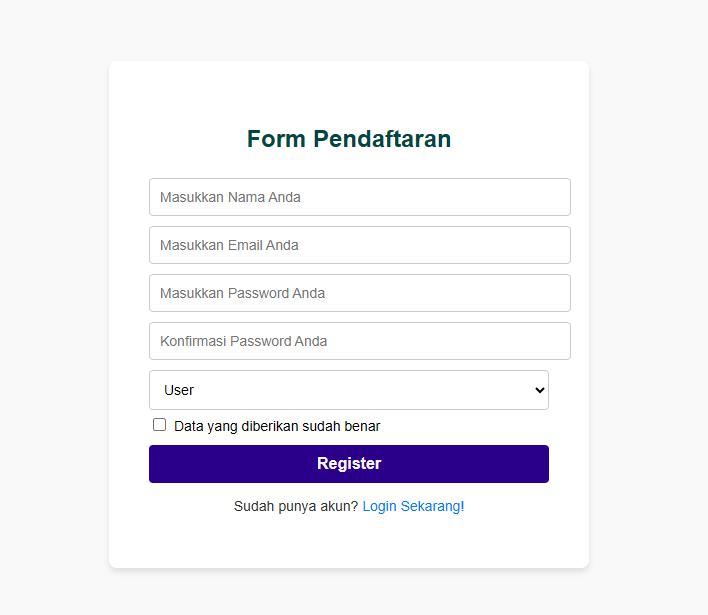
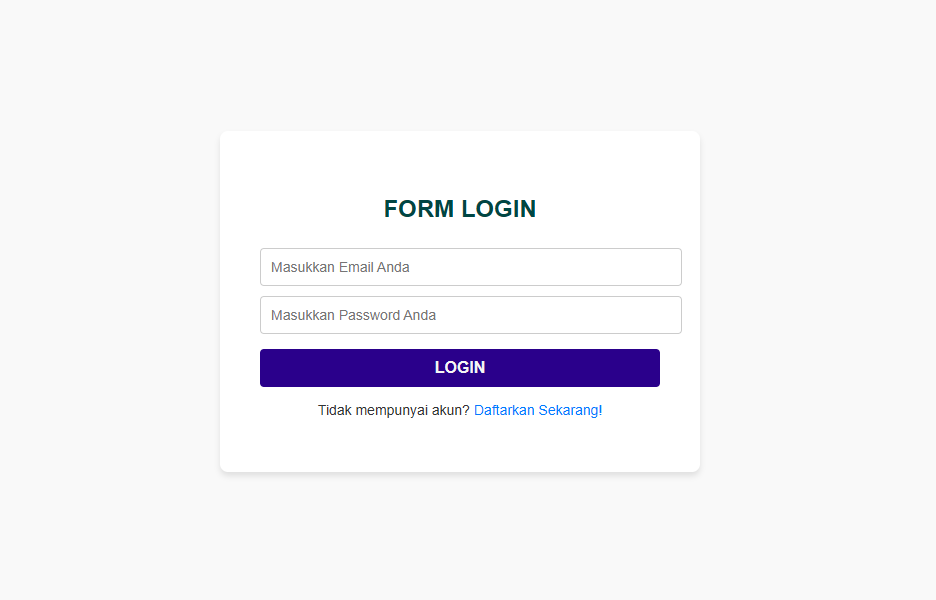
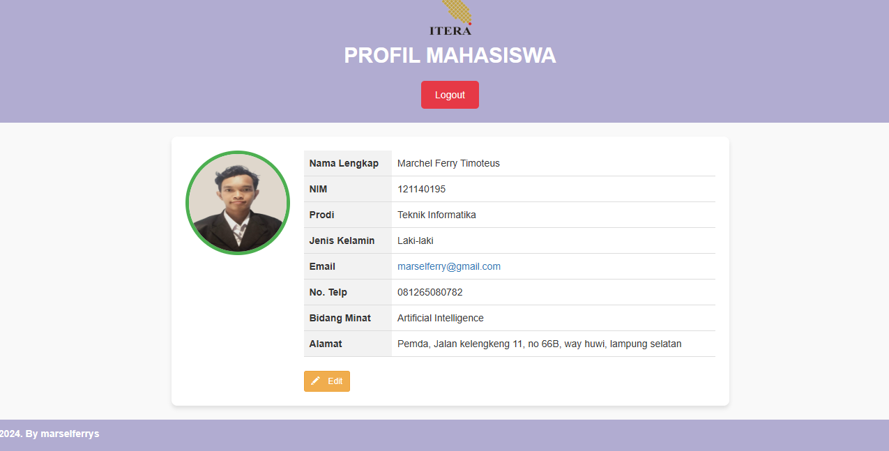
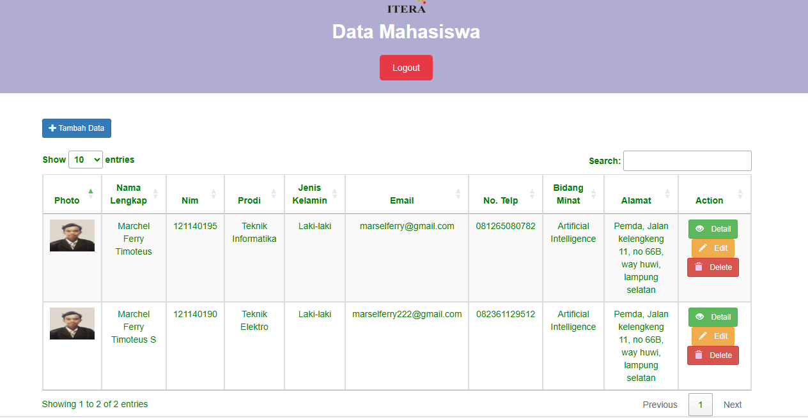
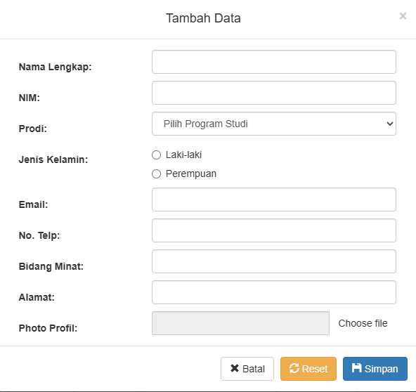
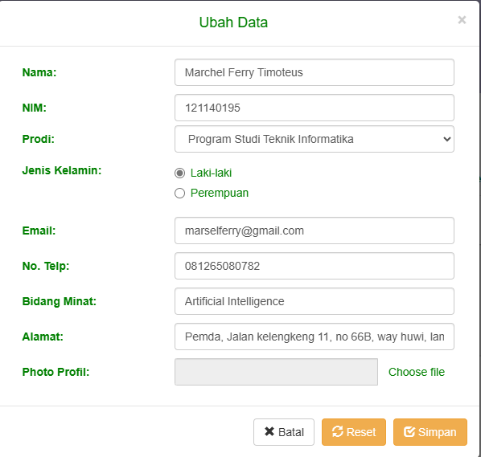
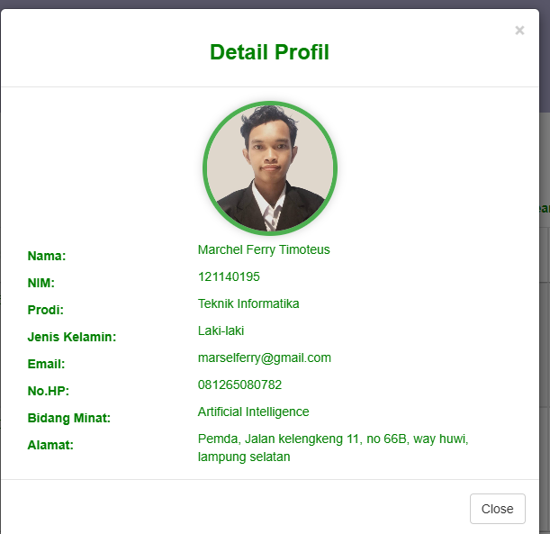
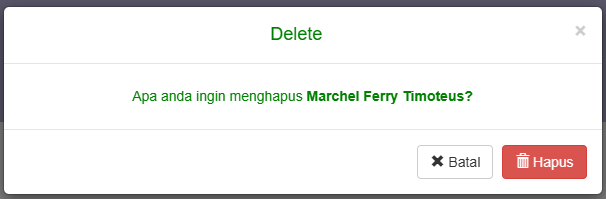

Nama: Marchel Ferry Timoteus S

NIM: 121140195

Link web:
[marchel-121140195-pwb.great-site.net](https://marchel-121140195-pwb.great-site.net/) 

Admin account:

email: marchel.121140195@student.iterac.a.cid

pass: 1234

User accout:

email: marselferry@gmail.com

pass: 123

# Hosting Aplikasi Web di InfinityFree

## Langkah-langkah untuk Meng-host Aplikasi Web:

1. **Registrasi Akun**
   - Kunjungi [InfinityFree](https://www.infinityfree.net/) dan daftar untuk akun gratis. Isi formulir pendaftaran dengan data yang valid.

2. **Buat Database**
   - Setelah akun Anda siap, buat database MySQL untuk menyimpan data aplikasi Anda. InfinityFree menyediakan layanan database MySQL gratis.

3. **Unggah File Aplikasi**
   - Gunakan FTP client seperti [FileZilla](https://filezilla-project.org/) atau pengelola file yang disediakan oleh InfinityFree untuk mengunggah file aplikasi Anda ke direktori `public_html`.

4. **Konfigurasi Aplikasi**
   - Sesuaikan konfigurasi aplikasi Anda dengan lingkungan hosting. Ini termasuk mengatur koneksi database, URL, dan pengaturan lainnya yang sesuai dengan server.

5. **Akses Aplikasi**
   - Setelah file diunggah dan konfigurasi selesai, akses aplikasi Anda menggunakan URL yang diberikan oleh InfinityFree.

## Penyedia Hosting yang Direkomendasikan

InfinityFree adalah pilihan yang baik untuk memulai, terutama untuk aplikasi web sederhana dengan anggaran terbatas. Namun, ada beberapa keterbatasan:

- **Keterbatasan Sumber Daya:** CPU dan RAM yang terbatas dapat memengaruhi performa jika traffic tinggi.
- **Fitur Terbatas:** Tidak sebanyak fitur yang ditawarkan penyedia hosting berbayar.
- **Stabilitas:** Berpotensi mengalami downtime atau penurunan performa.

### Alternatif untuk Aplikasi yang Berkembang

1. **Hostinger**
   - Paket hosting terjangkau dengan fitur yang cukup lengkap.
2. **Bluehost**
   - Populer untuk hosting WordPress dengan reputasi yang andal.
3. **A2 Hosting**
   - Dikenal karena kecepatan dan kinerja yang baik.

### Memilih Penyedia Hosting:
- **Anggaran:** Berapa banyak yang ingin Anda keluarkan?
- **Kebutuhan:** Sumber daya dan fitur apa yang diperlukan oleh aplikasi Anda?
- **Fitur:** Cari fitur seperti SSL, backup otomatis, dan dukungan teknis.

## Praktik Keamanan untuk Aplikasi Web

1. **Perbarui Aplikasi Secara Berkala:**
   - Selalu perbarui aplikasi dan komponennya untuk menambal kerentanan.

2. **Gunakan Password yang Kuat:**
   - Pastikan menggunakan password yang kuat dan unik untuk akun hosting dan database.

3. **Batasi Akses:**
   - Batasi akses ke direktori sensitif seperti admin atau konfigurasi.

4. **Pasang Firewall:**
   - Gunakan firewall untuk melindungi server dari serangan berbahaya.

5. **Backup Data Secara Berkala:**
   - Lakukan backup data secara teratur untuk mencegah kehilangan data.

6. **Aktifkan SSL/TLS:**
   - Amankan koneksi antara server dan browser pengguna dengan sertifikat SSL/TLS.

# Bagian-Bagian Website

## Form Daftar

## Form Login

## Halaman User

## Halaman Admin

## Form Tambah Data

## Form Edit Data

## Form Detail

## Tombol Hapus Data

